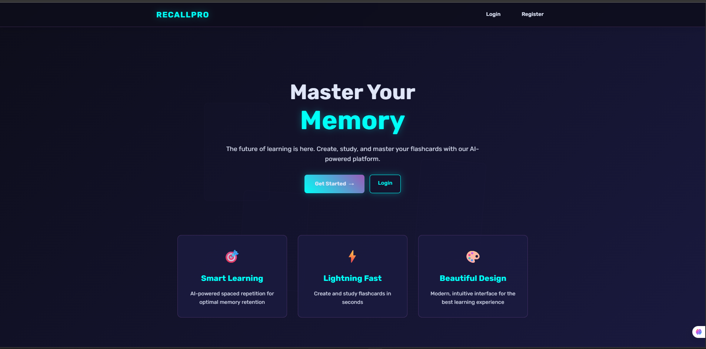
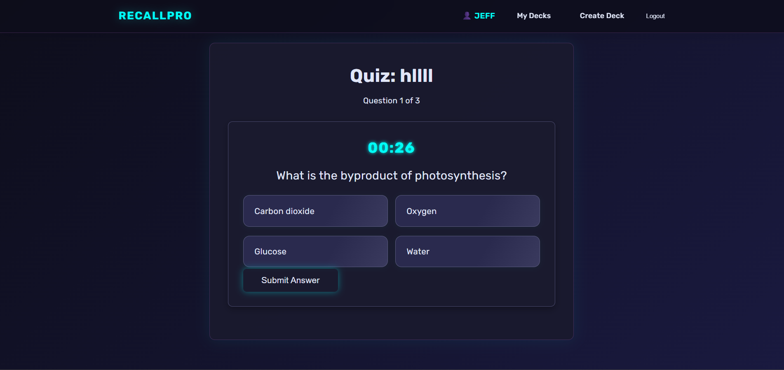
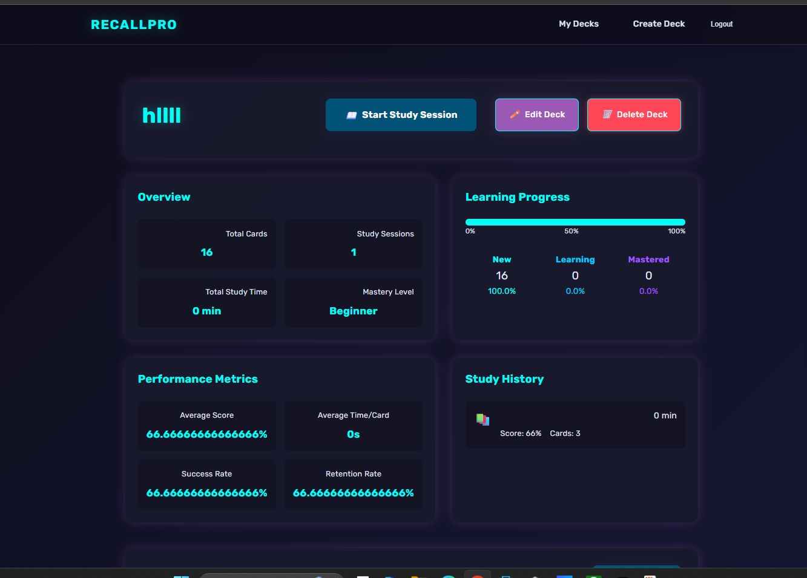

# 🚀 RecallPro: The Futuristic AI Flashcard App


[](https://www.python.org/)
[](https://www.djangoproject.com/)
[](LICENSE)
[](../../issues)
[](../../pulls)

> **RecallPro** is a next-gen, AI-powered flashcard and quiz platform with a stunning futuristic UI, advanced study analytics, and seamless AI card generation. Master anything, faster.

---

<details>
<summary>✨ <strong>Features</strong> (click to expand)</summary>

- 🤖 **AI Card Generation**: Instantly create MCQ flashcards from any text using LLMs
- 🗂️ **Deck & Card Management**: Create, edit, and organize decks and cards
- 🧑‍💻 **User Authentication**: Secure registration, login, and password reset (with security question)
- 🏆 **Quiz Mode**: Interactive, animated MCQ quizzes with instant feedback
- 📊 **Study Analytics**: Track mastery, study time, and performance metrics
- 🌈 **Futuristic UI**: Modern, responsive design with glowing effects and animations
- 🔒 **Access Control**: Only you can edit your decks and cards
- 📱 **Mobile Friendly**: Works beautifully on all devices
- 📝 **Admin Panel**: Full Django admin for power users
- ...and much more!

</details>

---

## 🖼️ Screenshots

> Add your own screenshots to the `screenshots/` folder and update the links below!

| Dashboard | Quiz | Deck Detail |
|---|---|---|
|  |  |  |

---

## 🚀 Quickstart

```bash
# 1. Clone the repo
$ git clone https://github.com/yourusername/recallpro.git
$ cd recallpro

# 2. Create a virtual environment and activate it
$ python -m venv venv
$ source venv/bin/activate  # On Windows: venv\Scripts\activate

# 3. Install dependencies
$ pip install -r requirements.txt

# 4. Run migrations
$ python manage.py migrate

# 5. Create a superuser (optional)
$ python manage.py createsuperuser

# 6. Start the server
$ python manage.py runserver
```

---

## 💡 Usage Guide

- **AI Card Generation**: Paste any text when creating a deck to auto-generate MCQ cards with AI.
- **Quiz Mode**: Click "Start Study Session" to launch an interactive quiz with instant feedback.
- **Study Analytics**: View your progress, mastery, and study history on the deck detail page.
- **Password Reset**: Use your security question for a secure password reset.

---

## 🤝 Contributing

We welcome PRs and issues! To contribute:
1. Fork the repo
2. Create a new branch (`git checkout -b feature/your-feature`)
3. Commit your changes
4. Push and open a Pull Request

See [CONTRIBUTING.md](CONTRIBUTING.md) for more.

---

## 📄 License

This project is licensed under the MIT License. See [LICENSE](LICENSE) for details.

---

## 🔗 Links

- [Documentation](docs/)
- [Open Issues](../../issues)
- [Discussions](../../discussions)

---

> Made with ❤️ using Django, SQLite, and AI. 
